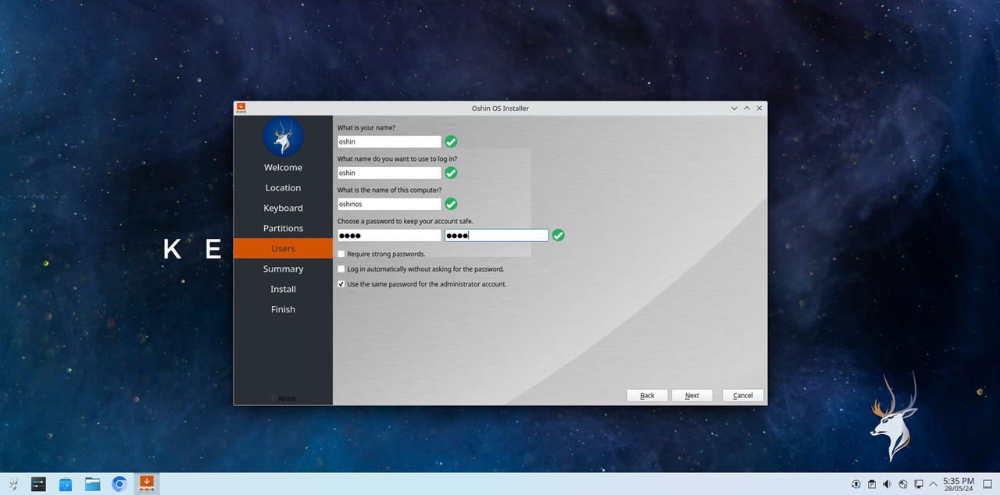

## Installing Oshin OS
This guide is for anyone who wants to install Oshin OS. Follow the steps below to install Oshin OS.

First, you need to create a bootable USB. If you have not created the bootable USB, then please check the guide [here](https://oshin-os-official.github.io/guides/boot-oshin-os/create-bootable-usb/)

Once you boot into Oshin OS, you will be greeted with the below screen. Login into the OS by giving the live user credentials ``oshin`` for both username and password. 

Once logged in, search for install system as shown below and select the ``Install System`` option.

Now, on the welcome screen of the calamares installer, select your desired language and click next.

Select your Region, Time Zone, and click on Next. If you are connected to the internet these will be adjusted automatically.

Select your Keyboard Layout and click on ``Next`` 

Now, it is time to partion the disks. 

!!!info Info
For this tutorial, the partioning is performed on a Virtual Machine Environment.
!!!

Now, Create a user account for yourself by filling the form below and click on Next

You will be given a summary of the entire installation. If you are satisfied with it, click on ``install``

