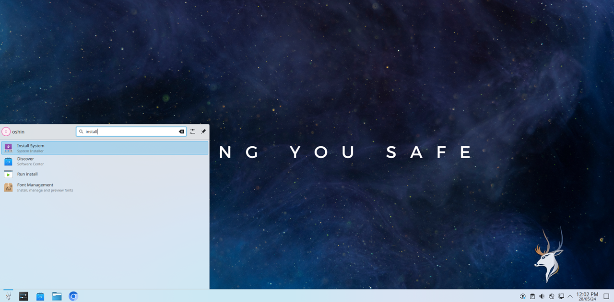

## Installing Oshin OS
This guide is for anyone who wants to install Oshin OS. Follow the steps below to install Oshin OS.

First, you need to create a bootable USB. If you have not created the bootable USB, then please check the guide [here](https://oshin-os-official.github.io/guides/boot-oshin-os/create-bootable-usb/)

# The initial steps
Once you boot into Oshin OS, you will be greeted with the below screen. Login into the OS by giving the live user credentials ``oshin`` for both username and password. 

Once logged in, search for install system as shown below and select the ``Install System`` option.

Now, on the welcome screen of the calamares installer, select your desired language and click next.

Select your Region, Time Zone, and click on Next. If you are connected to the internet these will be adjusted automatically.

